# cc-example-voting-app

## Objectifs

Mettre en place l’application open-source *Example Voting App* dans un cluster Kubernetes, comprendre son architecture et tester le cycle de vote en temps réel.

## Prérequis
- Un cluster fonctionnel
- kubectl installé et configuré
- Git

## Infrastructure
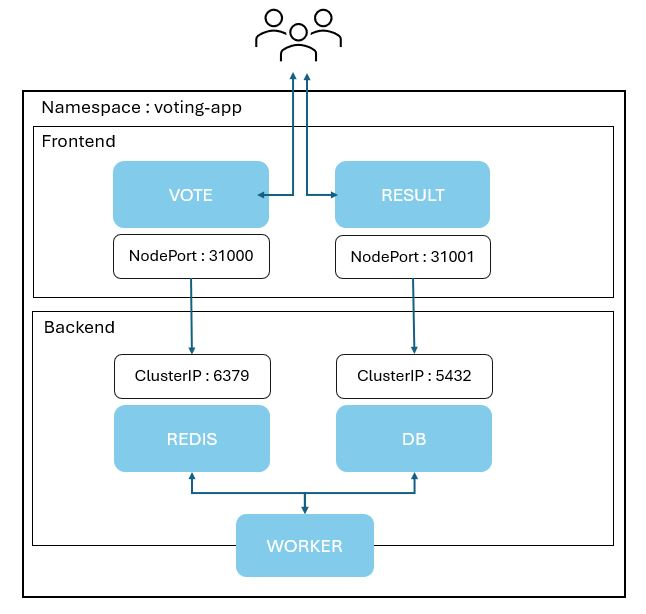

Voici l'architecture mise en place pour notre application.
On y retrouve nos différents pods et services ainsi que la communication entre eux.

L'application de vote fonctionne comme un système distribué composé de plusieurs services interconnectés. L'utilisateur interagit d'abord avec une application web frontend, qui lui permet de voter entre deux options. Lorsqu’un vote est soumis, il est envoyé à un serveur Redis, qui joue le rôle de file d’attente pour stocker temporairement les votes de manière rapide et efficace. Ensuite, un worker interroge Redis pour récupérer les nouveaux votes. Chaque vote récupéré est ensuite enregistré dans une base de données PostgreSQL, pour garantir que les données ne soient pas perdues en cas de redémarrage. Enfin, une application web se connecte à cette base de données pour afficher les résultats du vote en temps réel, en les mettant à jour dynamiquement afin que les utilisateurs puissent voir l’évolution des votes en direct.

## Déploiement

### Clonage du dépôt 
```bash
git clone https://github.com/dockersamples/example-voting-app.git
cd example-voting-app/k8s-specifications
```

### Déploiement des ressources Kubernetes
```bash
## Création d'un namespace pour isoler nos ressources
kubectl create ns voting-app  
  
## Déploiement des services de données
kubectl apply -f redis-deployment.yaml -n voting-app  
kubectl apply -f redis-service.yaml -n voting-app  
kubectl apply -f db-deployment.yaml -n voting-app  
kubectl apply -f db-service.yaml -n voting-app  
 
## Déploiement du worker
kubectl apply -f worker-deployment.yaml -n voting-app
 
## Déploiement des interfaces utilisateur (vote et résultats)
kubectl apply -f vote-deployment.yaml -n voting-app  
kubectl apply -f vote-service.yaml -n voting-app  
kubectl apply -f result-deployment.yaml -n voting-app  
kubectl apply -f result-service.yaml -n voting-app  
```

### Vérification
```bash
kubectl get pod -n voting-app  
```
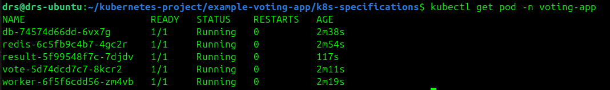
Pods : running
```bash
kubectl get deployment -n voting-app  
```
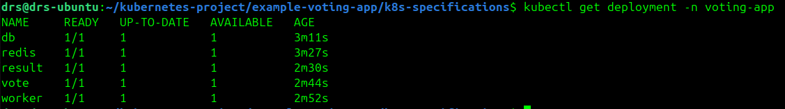
Déploiements : prêt
```bash
kubectl get rs -n voting-app 
```
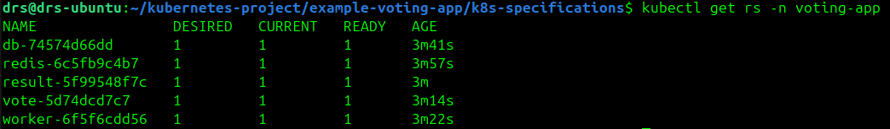
Desired : 1
```bash
kubectl get svc -n voting-app  
```
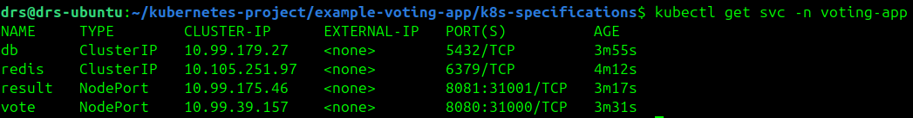
Service & ports

### Vue d'ensemble
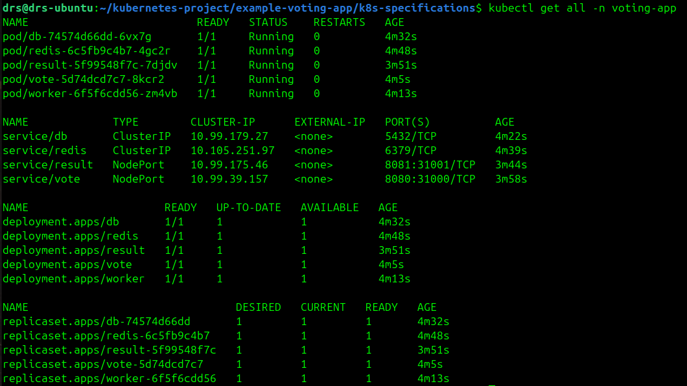
On retrouve bien toutes nos ressources créées et utilisées par notre application !

### Accès à l'application
Vérification de l'adresse ip du node avec la commande :
```bash
kubectl describe node   
```
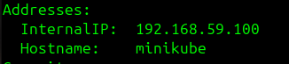

Depuis le navigateur : http://192.168.59.100:31000
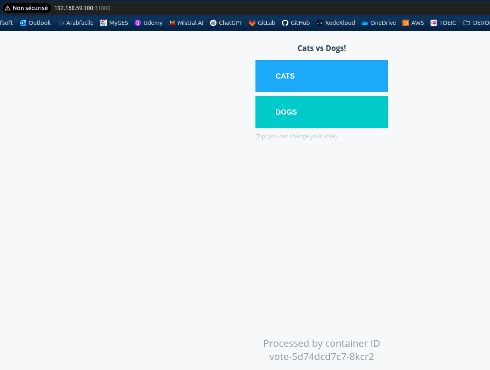
Accès à l'interface de resultat depuis le navigateur : http://172.180.0.29:31001
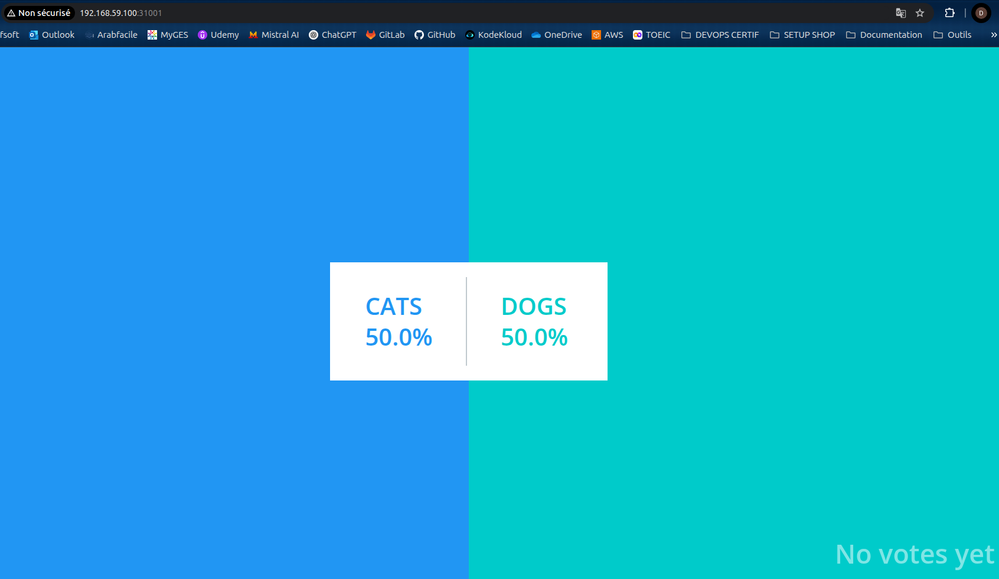
### Résultats 
Acutalisation des résultats en temps réel : 
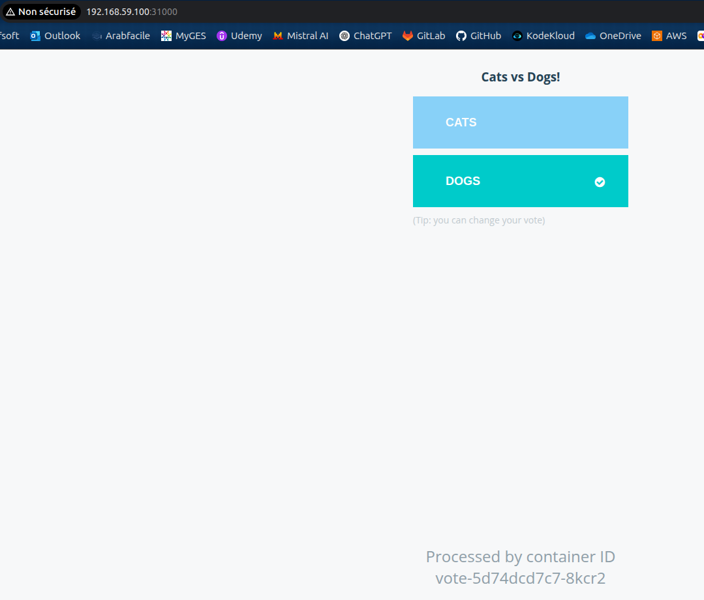
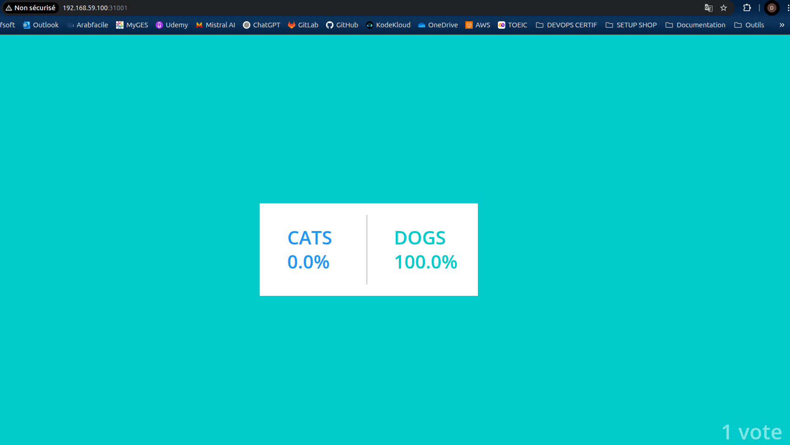
Notre application est donc bien fonctionnelle !
